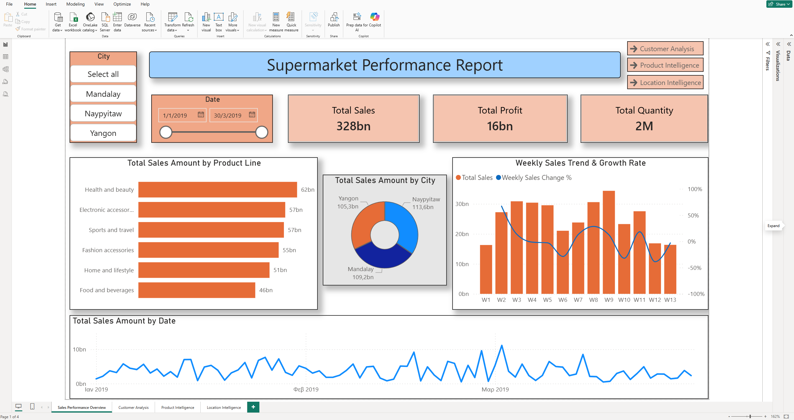
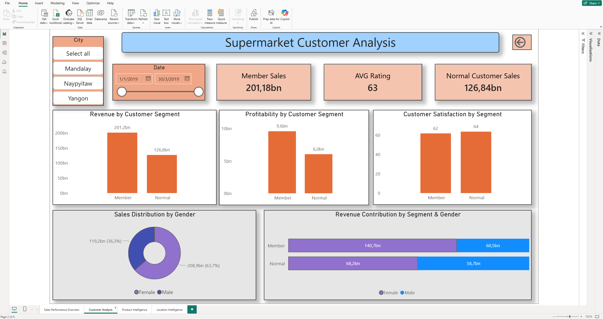
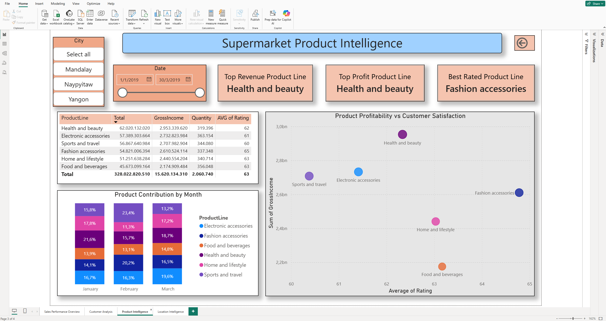
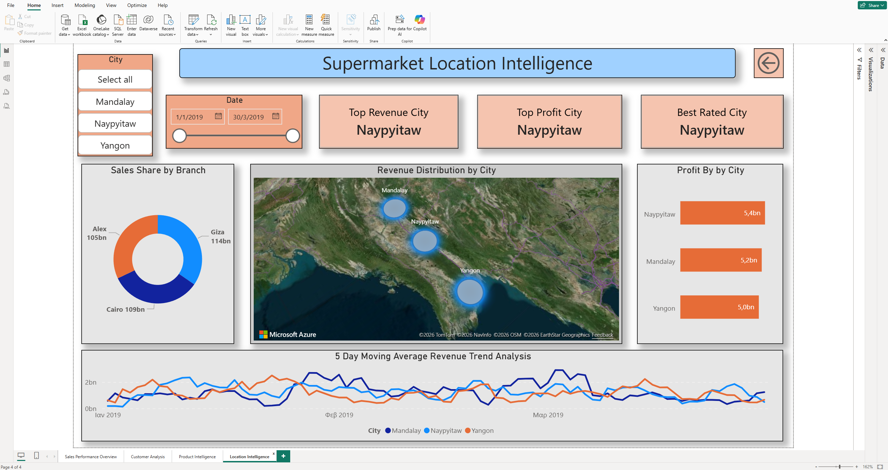
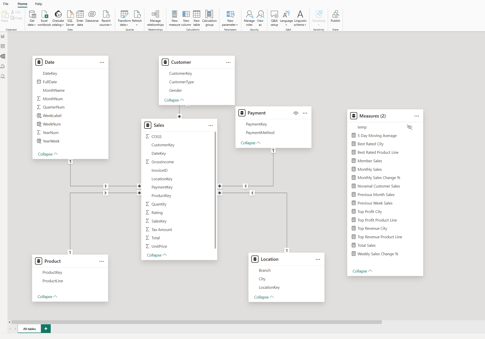

# Supermarket BI Data Warehouse

End-to-end Business Intelligence project using SQL Server, SSIS and Power BI, focused on building a complete data pipeline and delivering actionable insights through interactive dashboards.

## Project Overview

This project implements a complete BI pipeline for supermarket sales analysis.  
The solution starts from a CSV dataset, loads the raw data into a staging table, transforms it through an SSIS ETL process, stores it in a SQL Server Data Warehouse using a star schema model, and finally presents the results through interactive Power BI dashboards.

The goal of the project is to analyze sales performance across different business dimensions, including products, customers, locations, time periods and payment methods.

## Dataset

The dataset contains transactional data from a supermarket, including product details, customer information, branch locations, payment methods and financial metrics such as sales, cost and profit.

Source: Kaggle - Supermarket Sales Dataset

## Author

Dimitris Kympizis

## Architecture

CSV Dataset  
→ SSIS ETL Process  
→ SQL Server Staging Table  
→ Dimension Tables  
→ Fact Table  
→ Power BI Dashboards

## Data Warehouse Design

The Data Warehouse follows a star schema design.

The central fact table is:

- `Fact_Sales`

The dimension tables are:

- `Dim_Date`
- `Dim_Product`
- `Dim_Customer`
- `Dim_Location`
- `Dim_Payment`

The fact table stores measurable sales data such as:

- Unit price
- Quantity
- Tax percentage
- Total sales amount
- Cost of goods sold
- Gross income
- Customer rating

The dimension tables allow the analysis of sales by date, product category, customer type, location and payment method.

## ETL Process

The ETL process was developed in SQL Server Integration Services (SSIS).

The main ETL steps are:

1. Truncate the staging table before each new load.
2. Import raw data from the CSV file.
3. Apply data cleansing and data type conversions using SSIS transformations.
4. Load the cleaned data into the staging table.
5. Populate the dimension tables from distinct staging values.
6. Load the fact table by joining staging data with dimension tables and retrieving the related foreign keys.

## SQL Scripts

The SQL scripts are organized in execution order:

1. `01_create_database.sql`
2. `02_create_staging_table.sql`
3. `03_create_dimensions.sql`
4. `04_create_fact_table.sql`
5. `05_load_dim_tables.sql`
6. `06_load_fact.sql`

These scripts create the database structure and support the loading process from staging to the final Data Warehouse model.

## Power BI Dashboards

### Dashboard Screenshots

#### Overview


#### Customer Analysis


#### Product Intelligence


#### Location Intelligence


#### Data Model


The project includes interactive Power BI dashboards focused on four analytical areas:

### Sales Performance Overview

Provides a high-level overview of total sales, total profit, total quantity, sales by product line, sales by city, daily sales trend and weekly sales growth rate.

### Customer Analysis

Analyzes customer behavior by customer type and gender.  
The report compares sales, profitability, customer rating and revenue contribution across customer segments.

### Product Intelligence

Analyzes product category performance.  
It compares revenue, profit, quantity, customer rating and the relationship between profitability and customer satisfaction.

### Location Intelligence

Analyzes the geographical performance of sales.  
It includes city-level sales and profit analysis, branch contribution, map visualization and revenue trend by location.

## DAX Measures

Custom DAX measures were created to support the dashboard analysis, including:

- Total Sales
- Total Profit
- Average Rating
- Weekly Sales Change %
- Moving Averages
- Previous Period Sales

These measures allow dynamic calculations based on slicers and filters.

## Key Insights

The analysis shows that member customers generate higher revenue and profit compared to normal customers, indicating stronger purchasing behavior. Female members appear to be the most valuable customer segment in terms of overall contribution. From a product perspective, Health and Beauty stands out as the most profitable category, while location-based analysis reveals noticeable performance differences between cities and branches. Additionally, the weekly sales trend provides a clearer understanding of short-term fluctuations and sales dynamics.

## Technologies Used

- SQL Server
- SQL Server Management Studio (SSMS)
- SQL Server Integration Services (SSIS)
- Power BI
- DAX
- Star Schema Data Modeling

## Repository Structure

```text
sql/
  SQL scripts for database creation, staging, dimensions, fact table and loading

ssis/
  SSIS ETL process screenshots and documentation

powerbi/
  Power BI dashboard screenshots and report files

docs/
  Project documentation

data/
  Sample dataset or data reference
